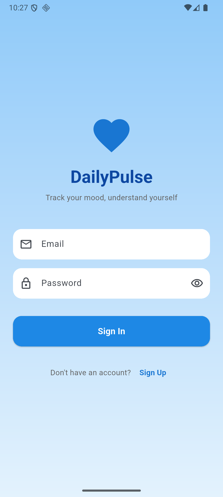
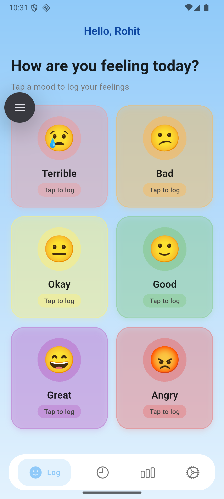
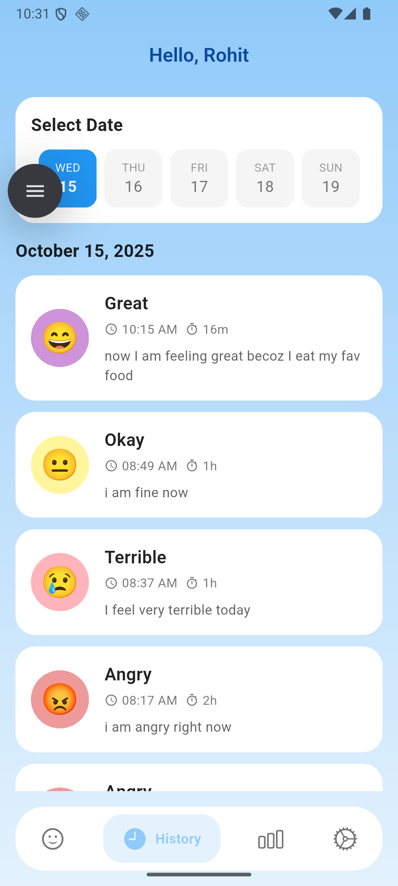
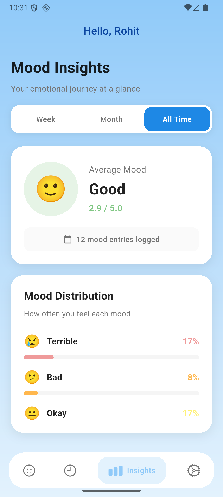
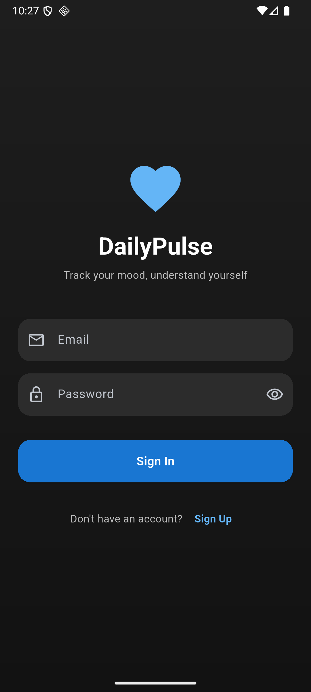
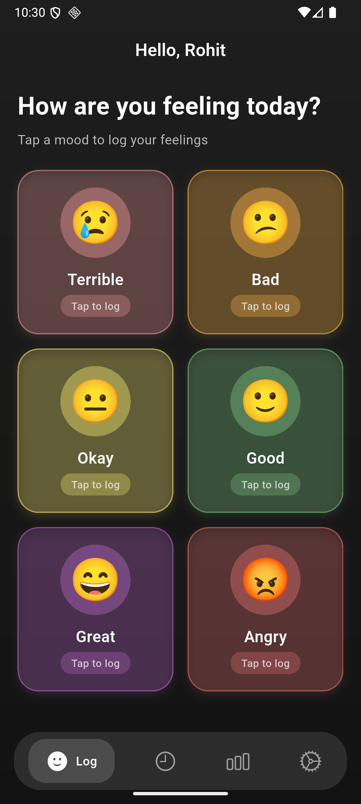
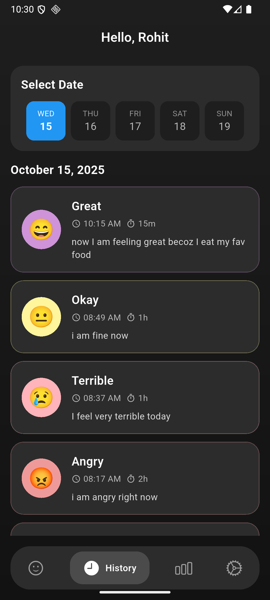
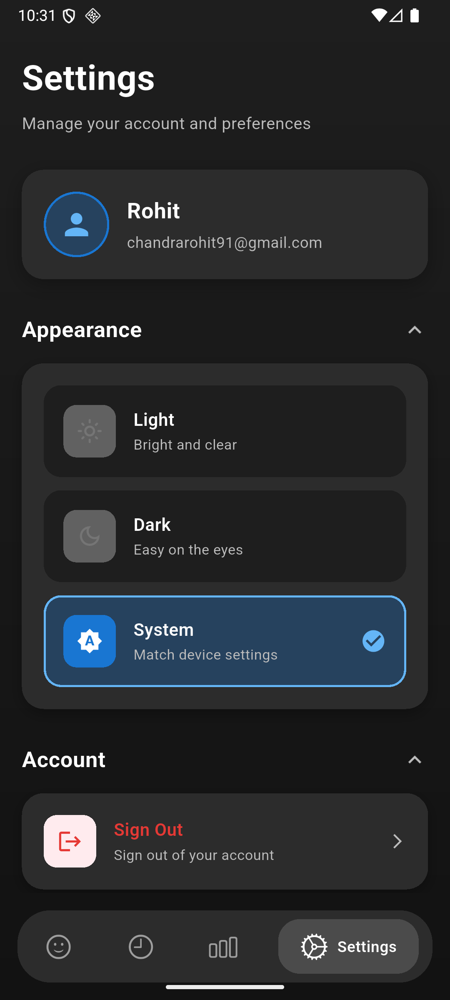

# DailyPulse

A minimalist mood tracking app built with Flutter. Track your emotions, understand patterns, and maintain your mental well-being.

**Inspired by beautiful designs from Dribbble**

## Overview

DailyPulse is a modern mood tracking application that helps users monitor their emotional well-being through a clean, intuitive interface. Built with Flutter, the app provides a seamless experience for logging daily moods, viewing historical patterns, and gaining insights into emotional trends. The app uses a 6-level emotion scale (Terrible, Bad, Okay, Good, Great, Angry) with emoji-based visual representation, making mood tracking quick and effortless.

The application follows an offline-first architecture, ensuring that users can log their moods anytime, anywhere, without depending on internet connectivity. All mood entries are instantly saved to local storage using Hive, and then automatically synchronized to Firebase Firestore in the background when connectivity is available. This approach guarantees data persistence and provides a smooth, lag-free user experience.

DailyPulse demonstrates modern Flutter development practices with clean architecture, efficient state management using Provider, and a feature-based project structure. The app supports both light and dark themes with smooth transitions, includes Firebase authentication for secure user management, and provides insightful analytics with time-based filtering (week, month, all time). The minimalist design, inspired by Dribbble's best mood tracking interfaces, focuses on reducing visual clutter while maintaining functionality and aesthetic appeal.

## Features

- 📝 Log moods with 6 emotion levels
- 📅 View history with date timeline
- 📊 Analyze patterns with insights
- 🔐 Secure Firebase authentication
- ☁️ Offline-first with cloud sync
- 🎨 Light & dark themes

## Setup

### Prerequisites
- **Flutter SDK:** ≥3.9.2
- **Dart SDK:** ≥3.9.2
- **Android Studio / VS Code** with Flutter plugins
- **Firebase Account** (free tier works)

### Installation

```bash
# Clone the repository
git clone https://github.com/yourusername/dailypulse.git
cd dailypulse

# Install dependencies
flutter pub get

# Generate Hive type adapters
flutter pub run build_runner build --delete-conflicting-outputs

# Check for issues
flutter analyze

# Run the app
flutter run
```

### Firebase Configuration

1. **Create Firebase Project**
   - Go to [Firebase Console](https://console.firebase.google.com/)
   - Create a new project or use existing one

2. **Add Android App**
   - Register app with package name: `com.example.dailypulse`
   - Download `google-services.json`
   - Place in `android/app/google-services.json`

3. **Add iOS App** (optional)
   - Register app with bundle ID: `com.example.dailypulse`
   - Download `GoogleService-Info.plist`
   - Place in `ios/Runner/GoogleService-Info.plist`

4. **Enable Services**
   - Enable **Authentication** → Email/Password
   - Enable **Cloud Firestore** → Start in test mode
   - Update Firestore rules for production (see below)

### Firestore Security Rules

```javascript
rules_version = '2';
service cloud.firestore {
  match /databases/{database}/documents {
    match /moods/{moodId} {
      allow read, write: if request.auth != null && 
                          request.auth.uid == resource.data.userId;
      allow create: if request.auth != null && 
                       request.auth.uid == request.resource.data.userId;
    }
  }
}
```

### Run Commands

```bash
# Development
flutter run                          # Run on connected device
flutter run -d chrome                # Run on Chrome (web)
flutter run --release                # Run in release mode

# Build
flutter build apk                    # Build Android APK
flutter build appbundle              # Build Android App Bundle
flutter build ios                    # Build iOS app
flutter build web                    # Build web app

# Testing & Analysis
flutter test                         # Run tests
flutter analyze                      # Analyze code
flutter pub outdated                 # Check outdated packages

# Code Generation
flutter pub run build_runner build   # Generate code once
flutter pub run build_runner watch   # Watch for changes
```

## Dependencies

### Core Dependencies
```yaml
dependencies:
  flutter:
    sdk: flutter
  
  # Firebase
  firebase_core: ^4.2.0              # Firebase initialization
  firebase_auth: ^6.1.1              # User authentication
  cloud_firestore: ^6.0.3            # Cloud database
  
  # Local Storage
  hive: ^2.2.3                       # NoSQL database
  hive_flutter: ^1.1.0               # Hive Flutter integration
  
  # State Management
  provider: ^6.1.2                   # State management solution
  
  # UI Components
  fl_chart: ^1.1.1                   # Charts and graphs
  easy_date_timeline: ^2.0.9         # Date picker timeline
  emoji_picker_flutter: ^4.3.0       # Emoji picker
  
  # Utilities
  intl: ^0.20.2                      # Internationalization
  uuid: ^4.5.1                       # UUID generation
  connectivity_plus: ^6.1.2          # Network status
  cupertino_icons: ^1.0.8            # iOS icons
```

### Dev Dependencies
```yaml
dev_dependencies:
  flutter_test:
    sdk: flutter
  
  flutter_lints: ^5.0.0              # Linting rules
  build_runner: ^2.4.13              # Code generation
  hive_generator: ^2.0.1             # Hive type adapters
  analyzer: ^6.4.1                   # Static analysis
```

## Screenshots

### Light Theme
<p float="left">
  
  
  
  
</p>

### Dark Theme
<p float="left">
  
  
  
  
</p>

## Architecture

```
lib/
├── core/
│   ├── app_theme/         # Theme configuration
│   ├── constant/          # App constants
│   ├── providers/         # State management
│   ├── routes/            # Navigation
│   ├── utils/             # Utilities
│   └── widgets/           # Reusable widgets
├── data/
│   ├── local/             # Hive storage
│   ├── models/            # Data models
│   ├── remote/            # Firestore
│   ├── repo/              # Repositories
│   └── services/          # Background sync
├── features/
│   ├── auth/              # Sign in/up
│   ├── history/           # Mood history
│   ├── home/              # Mood logging
│   ├── insights/          # Analytics
│   └── settings/          # App settings
├── app_scaffold.dart
└── main.dart
```

**State Management:** Provider for global state, setState for local UI state  
**Data Flow:** Local-first (Hive) → Background sync (Firestore)

## Emotion Logic

### Mood Scale (0-5)
| Level | Emoji | Label | Color |
|-------|-------|-------|-------|
| 0 | 😢 | Terrible | Pink |
| 1 | 😕 | Bad | Orange |
| 2 | 😐 | Okay | Yellow |
| 3 | 🙂 | Good | Green |
| 4 | 😄 | Great | Purple |
| 5 | 😡 | Angry | Red |

### Analytics Calculation

**Average Mood:**
```dart
avgMood = sum(all mood levels) / total entries
```

**Mood Distribution:**
```dart
percentage = (count of specific mood / total entries) × 100
```

**Time Filtering:**
- Week: Entries from last 7 days
- Month: Entries from last 30 days
- All: All recorded entries

### Design Choices

**Pastel Colors:** Calming, reduces visual stress  
**Emoji-First:** Universal, instant recognition  
**Minimalist UI:** Focus on emotions, not interface  
**Offline-First:** Always available, instant saves  
**Dark Mode:** Eye comfort, battery saving

**Inspired by:** Beautiful mood tracking designs from Dribbble

## Tech Stack

- **Framework:** Flutter 3.9.2+
- **State Management:** Provider
- **Local Database:** Hive
- **Backend:** Firebase (Auth + Firestore)
- **UI:** Material Design 3

## License

MIT License - feel free to use this project for learning or personal use.

---

**Built with Flutter** • Inspired by Dribbble designs
# DailyPulse
